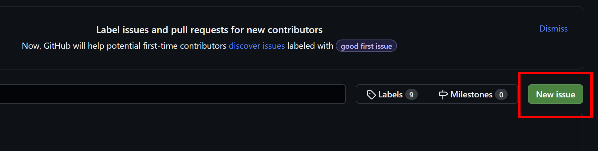

# joining sst-oss
For you to join the org, I need to send you a mail. Follow the following steps so that I can add you.
- go to https://github.com/probablyarth

- click on follow
- then go to [https://github.com/SST-OSS/invite-me-to-org](https://github.com/SST-OSS/invite-me-to-org)
- go to the issues tab

- click on new issue

- select the "get invited to sst org" template, click on get started

- fill your credentials and click on "submit new issue".

